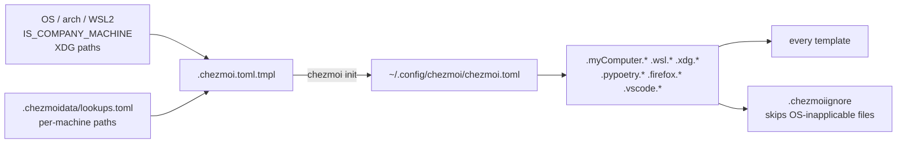
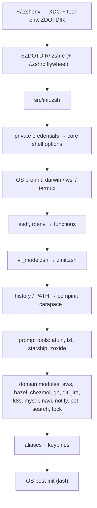
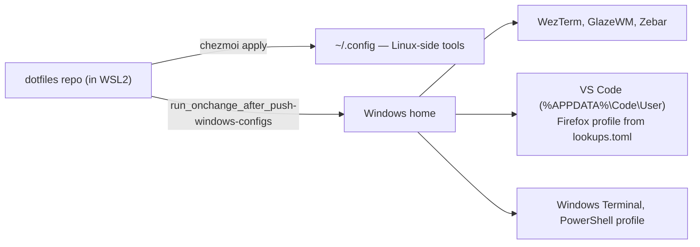

# My custom `dotfiles`

Personal, cross-platform dotfiles managed with [chezmoi](https://www.chezmoi.io/).
Targets macOS (primary), WSL2, plain Linux, Termux, and Windows, with per-OS
branches baked into the zsh startup sequence and into templated config files.

- [Quick start](#quick-start)
- [How it works](#how-it-works) — machine data, XDG, repository layout
- [Shell (zsh)](#shell-zsh)
- [Terminal & editor](#terminal--editor)
- [Python workspace](#python-workspace)
- [Tooling](#tooling) — git, tock, Claude Code, snippets, toolchains
- [Platform notes](#platform-notes) — WSL2, Windows

## Quick start

Prerequisite: [chezmoi](https://www.chezmoi.io/).

```sh
mkdir -p ~/workspace/jack06215
git clone https://github.com/jack06215/dotfiles ~/workspace/jack06215/dotfiles
chezmoi init --apply --source ~/workspace/jack06215/dotfiles
```

## How it works

### Machine data

`chezmoi init` renders `.chezmoi.toml.tmpl` into `~/.config/chezmoi/chezmoi.toml`,
recording the `--source` checkout as `sourceDir` so later commands need no flag.



On WSL2 the template also finds the Windows home (`.wsl.windowsHome`, e.g.
`/mnt/c/Users/<you>`) and `win32yank.exe`, and resolves the Firefox and VS Code
paths on the Windows side, since those apps run on Windows.
`.chezmoiignore` uses the same data to skip OS-inapplicable files and to drop
`.tool-versions` on one specific hostname.

**Values are baked in at init time.** After editing the template or
`lookups.toml`, run `chezmoi init` again (`chezmoi apply` warns when the
template has changed).

### XDG layout

Everything follows the [XDG base directory spec](https://specifications.freedesktop.org/basedir-spec/basedir-spec-latest.html) —
`dot_zshenv` sets `XDG_CONFIG_HOME`, `XDG_DATA_HOME`, `XDG_CACHE_HOME`,
`XDG_STATE_HOME`, `XDG_BIN_HOME`, then repoints dozens of tools (cargo, go, npm,
poetry, docker, gnupg, git, rustup, …) at XDG paths so `$HOME` stays clean.

### Repository layout

```
.chezmoi.toml.tmpl          → chezmoi config template (machine data; see above)
.chezmoidata/, .chezmoitemplates/ → lookup tables + the lookup/lookupPath helpers
.chezmoiscripts/            → run_ scripts (executed, never placed in ~)
dot_zshenv                  → ~/.zshenv (XDG + tool env vars, ZDOTDIR)
dot_tool-versions           → ~/.tool-versions (asdf-managed toolchain)
dot_config/
  zsh/                      → shell config
  claude/                   → Claude Code settings; skills/ symlinks to ../../skills
  git/, gh-dash/, lazygit/  → git tooling
  starship/                 → prompt theme (Nord palette)
  tock/                     → time tracker (tock.yaml; SQLite db under XDG_DATA_HOME)
  tmux/, tmux-powerline/    → multiplexer config, which-key menu, status bar
  wezterm/                  → terminal emulator (plain Lua + a rendered machine.lua)
  nvim/                     → LazyVim-based Neovim config
  zellij/                   → terminal multiplexer keybinds
  bottom/, btop/, htop/     → system monitors
  carapace/                 → shell completions
  npm/, pip/, pyproject/    → language package-manager config
  myscripts/, private_pet/  → misc scripts + `pet` snippet manager
  private_navi/             → `navi` cheatsheets: config.yaml, cheats/ (zsh)
                              and cheats-nu/ (nushell), ported from pet
  vscode/, firefox/         → VS Code settings, Firefox user.js + userChrome.css
  windows-terminal/         → Windows Terminal settings (jsonnet source + json)
  powershell/               → PowerShell 7 profile, MyModule, Scripts, and the
                              Chocolatey/winget manifests
dot_glzr/
  glazewm/, zebar/          → Windows tiling WM + status bar
```

Repo-maintenance entry points live at the root:

| Path | Purpose |
| --- | --- |
| `brewfiles/` | per-OS Homebrew manifests (`darwin`, `wsl2`) carrying taps + formulae + casks + tap trust; `Brewfile.tmpl` renders the matching one to `~/Brewfile` for `brew bundle install`, and `generate-brewfile.sh` regenerates the one for the machine you are on |
| `BUILD.bazel`, `MODULE.bazel` | `bazel run //:export_brewfile_macos` / `export_brewfile_linux` regenerate the brewfiles. Not a build system for the dotfiles themselves; `.bazelrc` sets `--symlink_prefix=/` so no `bazel-*` symlinks appear in a chezmoi source tree |
| `skills/` | Claude Code skills (see [Claude Code](#claude-code)) |
| `prompt_repository/`, `template/` | reusable prompt/PR templates |
| `python/` | the Poetry workspace (see [Python workspace](#python-workspace)) |

## Shell (zsh)

`ZDOTDIR` is `~/.config/zsh`. `dot_config/zsh/dot_zshrc` is a thin loader that
sources Flywheel-specific overrides (`~/.zshrc.flywheel`) if present, then hands
off to `src/init.zsh`, which sources everything else in a fixed, commented order.

### Startup order



**The order is load-bearing for keybindings.** `zsh-vi-mode` initializes while
`zinit.zsh` sources it, and every module after that point (atuin, fzf, pet, navi,
`keybinds.zsh`) binds on top of it. Moving one of them above `zinit.zsh`
silently hands its keys back to the plugin.

Set `ZSH_DEBUG_INIT=1` or `ZSH_PROFILE_STARTUP=1` to trace/profile startup.

### Modules under `src/`

| File | Purpose |
| --- | --- |
| `core.zsh` | history opts, fallback `bindkey -v`, `is_macos`/`is_wsl`/`is_termux` predicates |
| `vi_mode.zsh` | settings for `zsh-vi-mode` (text objects, surround, `^A`/`^X` keyword switching, per-mode cursor, fast `<ESC>`); sourced before `zinit.zsh` because the plugin reads its `ZVM_*` options at source time. `ZVM_INIT_MODE=sourcing` + `ZVM_LAZY_KEYBINDINGS=false` are what stop it clobbering the atuin/fzf/pet/keybinds bindings made later. Also points `vv` (visual-mode `v`, edit the line in an editor) at nvim, copies yanks to the system clipboard with per-platform commands for WSL/termux, and themes the visual selection to Catppuccin Mocha |
| `zinit.zsh` | plugin manager bootstrap; `zsh-vi-mode` (must stay first), `fzf-tab`, `fast-syntax-highlighting`, `zsh-autosuggestions`, `zsh-completions` |
| `functions.zsh` | `fman`, `mkcd`, `topcmds`, `csv2json`, `ls_stats`, Poetry venv activate/deactivate, `send_notification` |
| `notify.zsh` | cross-platform `notify()` (terminal-notifier on macOS, BurntToast over `pwsh` on WSL) |
| `gh.zsh` | `gh`-based PR helpers: `ghpr` (fzf picker + gum action menu; fetches nothing until you type, then searches GitHub across every PR state — `#1234` for one PR, `ctrl-r` for the newest N; rows and preview come from `myscripts/ghpr-index`), CI watchers (`ghpr_watch`, `ghpr_checks_watch`), draft PR creation |
| `git.zsh` | git helper functions |
| `jira.zsh` | `jira_workitem` (via `acli`, rendered through `myscripts/jira_render.py`), `jira_project_list` |
| `chezmoi.zsh` | `chezmoi-data`: fzf browser over `chezmoi data` output |
| `pet.zsh` | binds `Ctrl-O` to `pet search` snippet lookup (`Ctrl-S` is tmux's prefix, so a `^S` binding never reaches zsh) |
| `navi.zsh` | binds `Ctrl-G` to the `navi` widget over `private_navi/cheats/*.cheat`, a port of pet's `snippet.toml`. Runs alongside pet rather than replacing it; `NAVI_CONFIG` in `dot_zshenv` pins the config path because navi otherwise resolves it per-platform (`~/Library/Application Support/navi` on macOS). nushell gets the same `Ctrl-G` from `dot_config/nushell/function.nu`, whose `navi` wrapper passes `--path` for `cheats-nu/` so the nu pipelines stay out of the zsh picker — the same split pet makes with `snippet.nu.toml` |
| `tock.zsh` | time tracking: `tk`, `tockpick`/`tkr`, `tkn`/`tkd`, `tks`/`tkc`/`tkl`/`tkw`/`tka` (see [Time tracking](#time-tracking-tock)) |
| `wezterm.zsh` | `wezterm_config`: gum-driven live tuning of WezTerm opacity, macOS blur / Windows backdrop, persisted in `~/.local/state/wezterm/appearance.json` of the machine WezTerm runs on (on WSL2 the Windows home) |
| `meetingbar.zsh` | bridges MeetingBar → Python (`meetingbar.read_json`) for meeting notifications |
| `search.zsh` | fzf-based search helpers |
| `aws.zsh`, `bazel.zsh`, `k8s.zsh`, `mysql.zsh`, `dart.zsh` | domain-specific shortcuts |
| `zsh_python_init.zsh` | resolves the Poetry-managed venv under `python` per OS and exports `ZSH_PYTHON_BIN`, `LLM_BIN`, `RUFF_BIN`, `ALEMBIC_BIN` + aliases |
| `executable_sleep.zsh` / `executable_wakeup.zsh` | sleepwatcher hooks (macOS); skip weekends, gate on `sleepwatcher.should_run`, drive a Teamspirit clock-in/out script |
| `myscripts/` | standalone executables: `fzf-listprojects`, `whisper-mic`, `transcribe-yt`, `convert-mp3-to-aiff`, `ghpr-index` (rows + preview for the `ghpr` picker), AWS role listing, sleepwatcher enable/disable, etc. |

## Terminal & editor

- **wezterm** (`dot_config/wezterm/wezterm.lua`) — one plain-Lua config for macOS
  and Windows, deciding per OS at runtime (`wezterm.target_triple`): the "Cmd"
  key layer is CMD on macOS and CTRL+SHIFT elsewhere (plain CTRL would take
  Ctrl-C/W/V/… from the shell); on Windows it opens the WSL2 distro through
  WezTerm's `WSL:<distro>` domain, and the first tab runs the tmux dev workspace,
  as on macOS. The per-machine facts it cannot work out itself (the distro, the
  login shell there) come from `machine.lua`, rendered from chezmoi data. It also
  defines hyperlink rules, including a custom `TICKET-123/branch-name` → GitHub
  monorepo tree link rule for Flywheel branches. Opacity, macOS blur and the
  Windows backdrop are read at runtime from
  `~/.local/state/wezterm/appearance.json` (falling back to the defaults at the
  top of `wezterm.lua`) and watched, so `wezterm_config` just writes that file —
  on WSL2 on the Windows side — and WezTerm reloads. On WSL2 the files reach
  `%USERPROFILE%\.config\wezterm` through the [Windows push](#wsl2--windows-config-push).
- **nvim** (`dot_config/nvim/`) — [LazyVim](https://github.com/LazyVim/LazyVim)
  starter, own fork at `jack06215/lazyvim-starter`.
- **zellij** (`dot_config/zellij/config.kdl`) — autogenerated keybind overrides.
- **starship** — Nord palette prompt. **atuin, fzf, zoxide** — shell history,
  search and navigation, wired in `init.zsh`. **lazygit**, **gh-dash** — git/PR
  TUIs; gh-dash is preconfigured with Flywheel-specific PR sections.
  **bottom, btop, htop** — system monitors.

### Dictionary completion (`dot_config/nvim/lua/plugins/blink/`)

English words complete in prose via `blink-cmp-dictionary`, scored below every
code source so they never outrank the LSP. The bulk word list is a build
artifact, not config: `run_onchange_after_generate-dictionary.sh.tmpl` writes
`$XDG_DATA_HOME/dict/words.txt` at apply time from `/usr/share/dict/words`,
Debian's `american-english`, or wordnet's index files, whichever it finds first —
and skips with a message if it finds none, leaving the source running on the
spell file alone. Definitions in the docs window need `wn`
(`brew install wordnet`) and are simply absent without it.

`spellfile` points at `dot_config/nvim/spell/en.utf-8.add`, which feeds the same
source, so a word added with `zg` completes immediately. **`zg` writes to the
chezmoi target**, so it needs `chezmoi add ~/.config/nvim/spell/en.utf-8.add`
afterwards or the next `chezmoi apply` reverts it.

### Japanese input

Two halves, because they solve different problems. Both read from
`run_onchange_after_generate-jisyo.sh.tmpl`, which at apply time takes SKK-JISYO
— a system-installed one (`apt install skkdic`) if there is one, otherwise
fetched once to `$XDG_CACHE_HOME/skk` — and writes
`$XDG_DATA_HOME/dict-ja/SKK-JISYO.utf8` (the decoded jisyo) plus
`$XDG_DATA_HOME/dict-ja/skk.txt` (a romaji-keyed table). With no jisyo and no
network it skips with a message and both halves stay inert.

- **Word completion** (`lua/plugins/blink/`) — type romaji, get the word in the
  blink menu, via `blink-cmp-im`: `nihongo` offers 日本語, and `shinbun` and
  `sinbun` both reach 新聞 because the generator transliterates every reading
  into Hepburn *and* Kunrei. **Covers nouns, compounds and proper nouns only** —
  SKK keeps verb and adjective stems in its okuri-ari half keyed like `わかr`, so
  there is no `wakarimashita` to complete; that is what skkeleton is for.
  **Off until toggled** (`<leader>uj` normal, `<M-j>` insert): romaji keys like
  `no`, `ni` and `to` are ordinary identifiers, so an always-on source would
  offer Japanese while coding. Set `SKK_JISYO_SIZE=M` before `chezmoi apply` for
  roughly a tenth of the entries — the table is read into memory on the first
  Japanese completion of a session, and that is the knob if the pause is
  noticeable.
- **SKK** (`lua/plugins/skkeleton/`) — a real IME in the buffer, for anything
  inflected: `<C-j>` in insert or cmdline toggles it, then `WakaRi` converts to
  分かり and you carry on typing ました. Conjugation cannot be precomputed — the
  jisyo cannot even tell godan from ichidan (分かる and 食べる are both `…r`) — so
  it needs live conversion, which is exactly what SKK is. Runs on the denops
  kensaku already loads, and lualine shows あ/ア while it is on. blink is
  suppressed while composing (`vim.b.completion`), or it would win `<CR>` and
  accept a completion instead of the candidate under ▼.
  Learned words go to `dot_config/nvim/skk/user-jisyo` — in the repo, for the
  same reason `spellfile` is, since every conversion you pick reorders your
  candidates. **Same caveat as `zg`**: skkeleton writes to the chezmoi target, so
  new entries need `chezmoi add ~/.config/nvim/skk/user-jisyo` or the next apply
  reverts them. `lua/plugins/skkeleton/README.md` documents the key model in full.

## Python workspace

A single Poetry project (`python/pyproject.toml` + `dot_tool-versions`) backs all
Python tooling invoked from zsh:

| Package | Purpose |
| --- | --- |
| `common/` | shared utilities (subprocess execution, path/sys helpers, LangChain invocation, LLM client, logging) |
| `llm_cli/` | LLM CLI plugin framework (`plugins/tools/*`, `plugins/models/*` for OpenAI/Azure backends) |
| `llm_backend/` | LLM-backed helpers, e.g. `gh_create_pr_body` (generates PR descriptions from a template) |
| `sleepwatcher/` | enable/disable sleepwatcher, `should_run` gate, sleep/wake hooks |
| `meetingbar/` | MeetingBar notification bridge and model |
| `whisper/` | Whisper transcription output post-processing |
| `docx2md/`, `pptx2md/`, `xlsx2md/` | Office-document-to-Markdown converters (parser/formatter/CLI per format) |
| `aws/`, `kubectl/` | AWS role/policy listing, kube context/namespace listing |
| `regexlib/` | country-specific regex validators (Taiwan, Japan, international) |
| `local_fs/` | filesystem utilities (e.g. copy-to-data-repo) |

## Tooling

### Git

`dot_config/git/config` sets `GIT_CONFIG_GLOBAL`-style global config:
`git-secrets` AWS credential-pattern scanning, a large alias set (`git a`
fzf-add, `git hist`/`git llog` graph logs, `git find` for pickaxe+diff via fzf),
rerere, GPG-signed commits, `origin main` as default branch, and custom merge
helpers for unmerged files.

### Time tracking (tock)

[tock](https://github.com/kriuchkov/tock) logs activities to a SQLite database at
`$XDG_DATA_HOME/tock/tock.db`. `dot_config/tock/tock.yaml` sets the backend, a
Catppuccin Mocha theme matching WezTerm and the tmux bar, and a six-tag
vocabulary (`deep`, `meeting`, `review`, `ops`, `admin`, `learning`) that the
shell picker offers and the calendar colours.

The point of the wiring is that tracking costs nothing to start and is impossible
to forget:

- **`tk`** (`src/tock.zsh`) starts — or switches to — an activity, taking the
  project from the git repository root you are standing in. `tk fix the exporter`
  is the whole interaction; bare `tk` asks via gum for a description, then a tag,
  then a note. Because `tock start` closes whatever is running at the new start
  time, `tk` is also the switch command, so there is nothing else to remember.
- **Notes** are the free-form half: what "done" looks like, the ticket URL, where
  you left off. The prompt is a `gum write` textarea — enter saves, ctrl+j is the
  newline, esc skips — and the argument forms of `tk` stay silent, so
  `tk fix the exporter` is still one step and `--note` sets one without asking.
  `tkr`/`tockpick` asks on the way back in and puts the note you left last time
  in the prompt header, which is the point: resuming shows you where you stopped.
- **The tmux status bar** (`tmux-powerline/segments/tock.sh`) shows the running
  activity, how long it has been going (yellow past 90 minutes, red past 5 hours
  — that one means nobody stopped it) and today's total. With nothing running it
  shows a dim `󰅐 —`, which is the part that matters: a tracker that is silently
  off produces wrong numbers.
- **`prefix + Space`, then `k`** opens the same actions as popups — start/switch,
  resume from history, stop, calendar, reports, stopwatch. `tk` and `tockpick`
  reach a non-interactive popup shell through the `zshfn` dispatcher
  (`dot_local/bin/`), not through duplicated scripts.

<details>
<summary>Why the sqlite backend</summary>

tock's tidier default `file` backend is out on a measured fact: on the version
homebrew-core ships (1.9.8) it accepts tags and silently discards them — `--tag`
writes nothing, `tock tag` reports success and writes nothing, and no `tags`
field ever reaches `--json`. That left `todotxt` and `sqlite`, and notes decide
it. On `todotxt` a note is not in the log at all — it goes to a sidecar file
named after the activity's start second under a hidden `.tock/notes/`, so the log
stops being the whole record, grepping it misses the notes, and copying it leaves
them behind. On `sqlite` the note is a column on the activity's own row, so it
travels with the entry through `--json`, `-F '{{.Notes}}'` and every export.

The cost is that the log is no longer plaintext, greppable, or diffable;
`tock export --fmt json --stdout` and `sqlite3` are the ways back out, and the
schema (one `activities` table) is documented at the bottom of `tock.yaml`.
Per-call cost is unchanged at ~7 ms, so the status bar does not notice.

Unlike the todotxt backend, sqlite does not create its parent directory — a
missing one fails every tock call outright — so `dot_local/share/private_tock/`
carries a `.keep` to make `chezmoi apply` create it first, at `0700` since
working notes live in there.

`working_hours` in `tock.yaml` is the backstop for an activity left running
overnight, and is the one setting left switched off — it needs a cutoff hour, and
a guessed one truncates real work.

</details>

### Claude Code

`dot_config/claude/settings.json` sets theme/editor mode. Skills live at the repo
root under `skills/` (currently `commit-writer`, a Conventional Commits-based
commit skill, and `youtube-transcribe`), kept out of the chezmoi target tree by
`.chezmoiignore` and surfaced to Claude Code by
`dot_config/claude/symlink_skills.tmpl`, which points `~/.config/claude/skills`
at them with a relative symlink. **Editing a skill in the repo takes effect
immediately** — no `chezmoi apply` needed.
`myscripts/set_mcp_server_claude_desktop.py` patches Claude Desktop's MCP server
config on disk.

### Snippets & scripts

- `dot_config/private_pet/` — [pet](https://github.com/knqyf263/pet) snippet
  manager config + `snippet.toml`, plus a `gh_pr_reviews.py` helper for pulling
  PR review history via `gh`/GraphQL.
- `dot_config/private_navi/` — [navi](https://github.com/denisidoro/navi)
  cheatsheets ported from pet; `cheats/` for zsh, `cheats-nu/` for nushell.
- `dot_config/myscripts/` — `jira_render.py` (renders `acli` JSON issue output),
  `set_mcp_server_claude_desktop.py`.

### Toolchain versions

Managed via [asdf](https://asdf-vm.com/) (`dot_tool-versions`): dasel, helm, java
(oracle-graalvm), jq, kind, kubectl, kustomize, node, python, shellcheck, shfmt,
mysql, poetry.

On Windows the same file is read by [mise](https://mise.jdx.dev/) instead — asdf
is a bash program and does not run there. 11 of the 13 install; java and mysql
are skipped, and [docs/windows-setup.md](docs/windows-setup.md) explains why.

## Platform notes

### WSL2 → Windows config push

On a WSL2 machine the Windows apps read their config from the Windows home, which
`chezmoi apply` inside WSL never touches (and which cannot follow a symlink into
the WSL filesystem). `run_onchange_after_push-windows-configs` copies them there
from the repo directly.



It reruns whenever one of them changes. A Windows-side copy that differs from
what it last wrote (edited on Windows, or there before it) is kept as
`<name>.chezmoi-backup-<timestamp>` before being replaced.

### Windows

Provisioning maps onto the Unix side one piece at a time:

| Unix | manifest | Windows |
| --- | --- | --- |
| Homebrew | `brewfiles/` | Chocolatey, `dot_config/powershell/chocolatey/packages.config` |
| — | — | winget, `dot_config/powershell/winget/packages.json`, for what Chocolatey lacks |
| asdf | `dot_tool-versions` | mise, reading the same file |
| `setup.sh` | — | `setup.ps1` (`executable_setup.ps1.tmpl`) |
| `generate-brewfile.sh` | — | `generate-chocofile.ps1` |

`setup.ps1` requires an elevated PowerShell 7, since Chocolatey installs
machine-wide. The PowerShell profile lives in `dot_config/powershell/` and is
copied into `Documents\PowerShell` — the only path pwsh reads `$PROFILE` and its
per-user `PSModulePath` entry from — by
`run_onchange_after_link-powershell-profile.ps1` on Windows, or by
`run_onchange_after_push-windows-configs.sh` from WSL2. Neovim, VS Code and the
language servers are deliberately absent: development happens in WSL2.

**Window management:** `dot_glzr/glazewm/config.yaml` + `dot_glzr/zebar/`
configure [GlazeWM](https://github.com/glzr-io/glazewm) (tiling WM) and
[Zebar](https://github.com/glzr-io/zebar) (status bar).

See **[docs/windows-setup.md](docs/windows-setup.md)** for the bootstrap on a
brand-new machine, the manual steps, and the known gaps.
