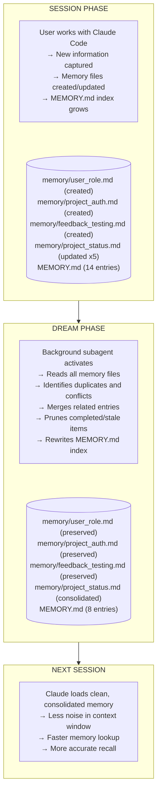

# How Auto-Dream Works — Technical Deep-Dive

## Discovery

The `autoDreamEnabled` setting was found through binary analysis of Claude Code's `cli.js` bundle. The relevant string extracted from the binary:

> "Enable background memory consolidation (auto-dream). When set, overrides the server-side default."

This confirms that auto-dream is a client-side toggle for a server-coordinated feature. The setting tells Claude Code to opt in to background memory processing that would otherwise be controlled (or disabled) by server-side configuration.

## The REM Sleep Analogy

Human memory consolidation during REM sleep follows a well-studied pattern:

| Sleep Stage   | Brain Activity              | Memory Effect                                 |
| ------------- | --------------------------- | --------------------------------------------- |
| Light sleep   | Reduced activity            | Short-term buffer flush                       |
| Deep sleep    | Slow oscillations           | Declarative memory consolidation              |
| **REM sleep** | **High activity, dreaming** | **Emotional processing, pattern integration** |

Auto-dream mirrors the REM stage: it actively processes accumulated memories, identifies patterns, resolves conflicts, and produces a consolidated representation.

## Memory Lifecycle

## What the Subagent Does

Based on analysis, the dream subagent likely performs these operations:

### 1. Inventory

Reads `MEMORY.md` and all files in the memory directory. Builds a dependency graph of which memories reference each other.

### 2. Conflict Detection

Identifies entries that contradict each other — typically caused by evolving project state recorded across multiple sessions without cleanup.

### 3. Deduplication

Groups semantically similar entries. When multiple memory files describe the same concept (e.g., three different "project status" snapshots), the subagent keeps the most recent and specific version.

### 4. Staleness Check

Flags entries that reference completed work, past deadlines, or superseded decisions. These are candidates for removal.

### 5. Index Rewrite

Regenerates `MEMORY.md` with consolidated pointers. The index stays under the 200-line display limit.

## Server-Side vs Client-Side

The setting description mentions "overrides the server-side default," which implies:

- **Server-side**: Anthropic can enable/disable auto-dream globally or per-account
- **Client-side**: The `autoDreamEnabled` preference lets users opt in regardless of server default
- **Override behavior**: Client setting takes precedence when set

This architecture allows Anthropic to roll out the feature gradually while letting power users opt in immediately.
